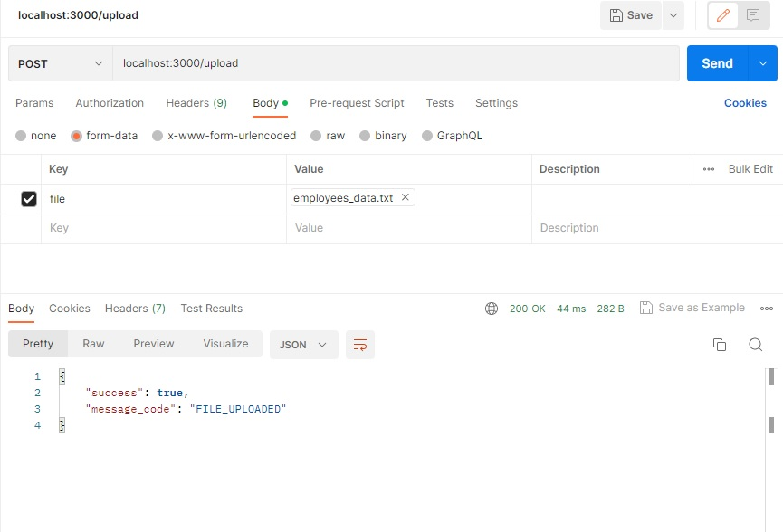
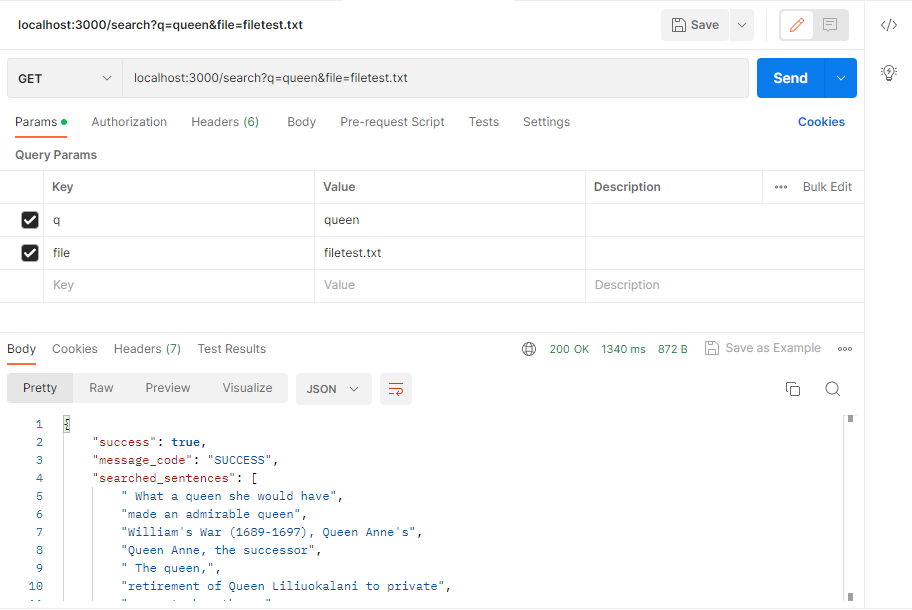
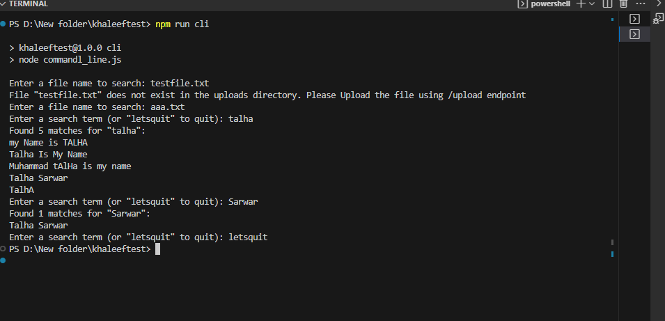
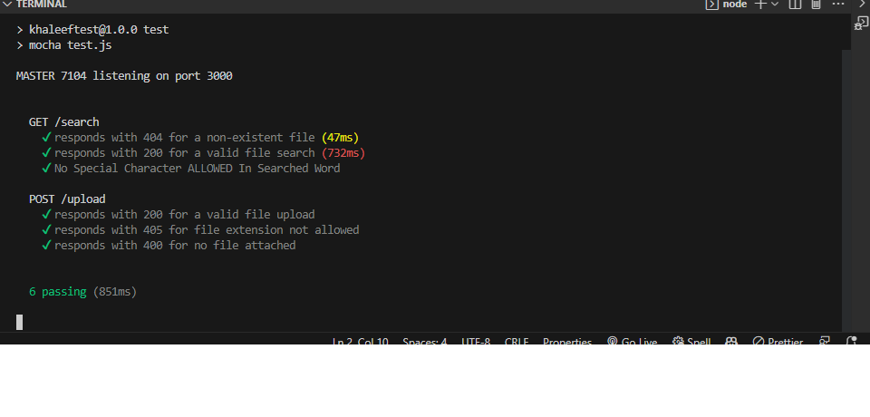

RUN npm install & install go on your system before proceding

This repository includes working solution of Software Architect Test Project,it includes the following solutions
1) REST API solution using express server node js
2) unit test solution using mocha and supertest Modules
3) command line application solution using node js and golang

<h3>Express entrypoint app.js</h3>
RUN the express app using npm start command.Please ensure to change env variable NODE_ENV to production in order to run the application in clustered mode which scales according to the CPU cores and change the above mentioned environment variable to development in order to run the test suite using npm test command or mocha test.js command.
<h3>Express Endpoints</h3>
1) /upload : accepts a POST request and with expected file parameter.ONLY TEXT files are allowed to be uploaded.Please look at the following example
 

2)/search : accepts a GET request and with expected parameters q and file where q is the word that is to be searched in the given file and file is the name of the file.Please note only those files will be searched which are inside the uploads directory.Look at the following image for more information

<h3>COMMAND LINE NODE.js</h3>
RUN the command line appli
cation using npm run cli command

<h3>COMMAND LINE golang</h3>
RUN the command line application developed using golang by executing the commandLine.exe or by running the go run main.go command

<h3>UNIT TEST CASES</h3>

<h3>MONITORING NODE JS APPLICATION</h3>
Logging,Performance Metrics,Health Checks and memory profiling can be used to monitor the node js app .Tools like pm2 for process management & Prometheus for monitoring and alerting can be used with open source data visualization platform like kibana for visualization and analysis of metrics data

<h3>Security Measures</h3>
1) convert to express server to https using SSL/TLS encryption.use https modules and pass ssl certifcate.
2) use nginx to reverse proxy the node js express server
3) use modules like helmet that helps to secure the express app by setting various HTTP headers related to security
4) use modules like chokidar that watches files and directories for changes and triggers events when they occur.
5) if deploying on linux environment ensure to remove root user account from a Linux machine and use a non-root user account with sudo privileges instead.

<h3>Recommenation for hosting solution at large sale</h3>

1)If monolith Architecture is followed then ensure to scale the app vertically according to the cores of machine to improve performance,availablity & better resource utilization.use load balancer like nginx to balance the load b/w multiple instances.
1.a)Use a caching mechanism to improve the performance of the app like redis.

2)If microservices Architecture is followed then ensure to scale the app horizontally using docker and use load balancer like nginx to load balance b/w multiple instances of that specifc microservice.
2.a) Use Messagebroker or messaging Queue System like rabbitMQ,redis Streams,NATS or kakfa to communicate with other services.This ensures asynchronous processing
2.b)Use a caching mechanism to improve the performance of the app like redis.

.

